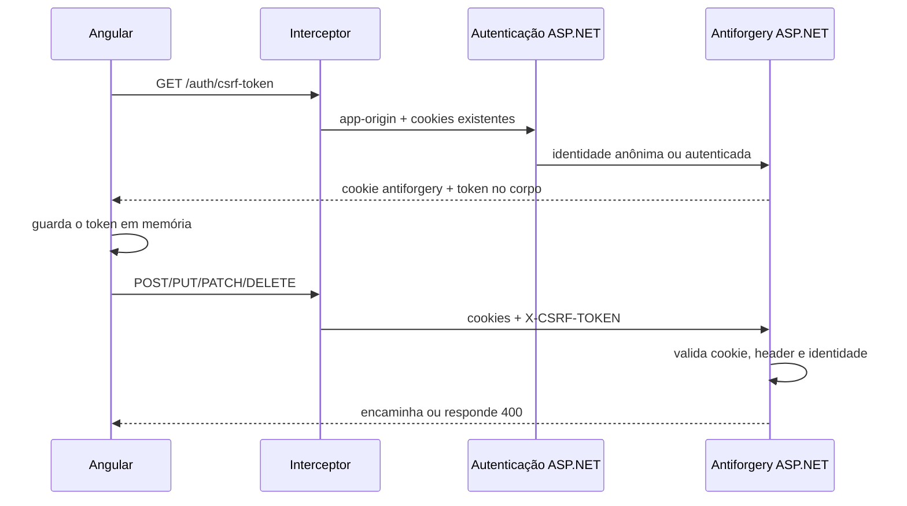
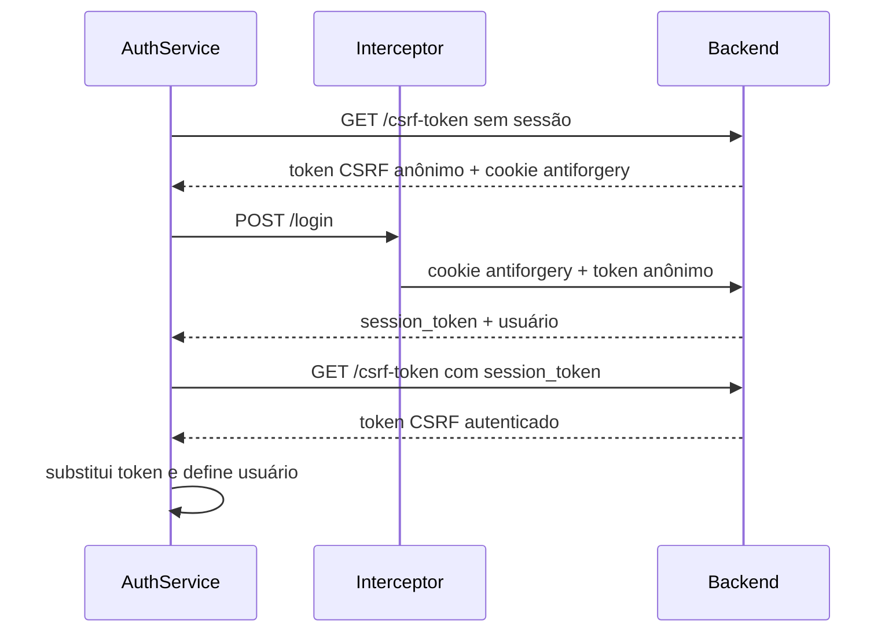

# Fluxo de proteção CSRF

Este documento descreve a implementação de CSRF do projeto, desde a configuração do ASP.NET Core até o uso pelo Angular. O objetivo é deixar claro quais valores existem, quem os cria, onde são armazenados e por que o token precisa ser renovado quando a identidade muda.

## 1. Qual problema esta proteção resolve

O frontend web autentica usando o cookie `session_token`. Como o navegador envia cookies automaticamente, uma página maliciosa poderia tentar disparar uma operação contra a API enquanto o usuário está autenticado.

A proteção antiforgery exige uma segunda informação que não é enviada automaticamente pelo navegador: o token presente no header `X-CSRF-TOKEN`.

Para uma operação protegida ser aceita, o backend precisa receber um conjunto válido:

```text
cookie antiforgery + header X-CSRF-TOKEN + identidade atual
```

O site atacante pode provocar o envio automático dos cookies, mas não conhece o token guardado em memória pelo Angular para construir o header correto.

CSRF não substitui CORS, autenticação ou proteção contra XSS. Cada mecanismo protege uma fronteira diferente.

## 2. Valores envolvidos

| Valor | Criado por | Armazenado em | Função |
|---|---|---|---|
| `session_token` | Backend após o login | Cookie `HttpOnly` | Identifica a sessão autenticada |
| `p2_csrf` | Antiforgery em desenvolvimento | Cookie `HttpOnly` | Parte secreta do par antiforgery |
| `__Host-p2-csrf` | Antiforgery fora de desenvolvimento | Cookie `HttpOnly`, `Secure`, path `/` | Parte secreta do par antiforgery |
| Token de requisição | Endpoint `GET /api/auth/csrf-token` | Memória do `CsrfService` | Valor enviado como `X-CSRF-TOKEN` |
| `X-CSRF-TOKEN` | Interceptor Angular | Header de cada operação mutável | Permite ao backend validar o par antiforgery |
| `app-origin` | Interceptor Angular | Header da requisição | Identifica o tipo de cliente como `web`; não é o token CSRF |

Os dois cookies têm responsabilidades independentes:

- o cookie antiforgery participa da validação CSRF;
- o `session_token` localiza a sessão e autentica o usuário.

O token CSRF não contém nem referencia diretamente o valor literal do `session_token`. Entretanto, o token de requisição é validado considerando a identidade atual. Por isso, um token gerado como anônimo não deve ser reutilizado depois do login.

## 3. Visão geral do fluxo



## 4. Backend

### 4.1 `CsrfBuilder`

Arquivo: [`CsrfBuilder.cs`](backend/csharp_p2/src/Config/Builder/Configs/CsrfBuilder.cs)

Registra o serviço padrão de antiforgery do ASP.NET Core por meio de `AddAntiforgery`.

Configurações:

- `HEADER_NAME`: constante com o nome `X-CSRF-TOKEN`;
- `options.HeaderName`: informa ao ASP.NET em qual header procurar o token de requisição;
- `options.Cookie.Name`: usa `p2_csrf` em desenvolvimento e `__Host-p2-csrf` nos demais ambientes;
- `HttpOnly = true`: impede que JavaScript leia o cookie antiforgery;
- `SecurePolicy`: exige HTTPS fora de desenvolvimento;
- `SameSite`: usa `Lax` em desenvolvimento e `None` em produção, permitindo a arquitetura com frontend e API em origens distintas;
- `Path = "/"`: torna o cookie disponível para toda a API.

Não foi configurado `MaxAge` ou `Expires`. Portanto, o cookie antiforgery é um cookie de sessão do navegador e o token não possui um TTL explícito dentro da aplicação.

### 4.2 `BuilderConfig`

Arquivo: [`BuilderConfig.cs`](backend/csharp_p2/src/Config/Builder/BuilderConfig.cs)

Executa `CsrfBuilder.AddCsrf(builder, env)` durante a criação da aplicação. Isso disponibiliza `IAntiforgery` para injeção no controller e no middleware.

### 4.3 `AuthBuilder` e `SessionAuthHandler`

Arquivos:

- [`AuthBuilder.cs`](backend/csharp_p2/src/Config/Builder/Configs/AuthBuilder.cs)
- [`SessionAuthHandler.cs`](backend/csharp_p2/src/Modules/Auth/Authentication/SessionAuthHandler.cs)

`AuthBuilder` registra `SessionAuthHandler` como esquema padrão de autenticação e cria uma política fallback que exige autenticação, exceto quando o endpoint possui `[AllowAnonymous]`.

O `SessionAuthHandler`:

1. procura o token de sessão no header `Authorization` ou no cookie `session_token`;
2. consulta a sessão no cache;
3. valida se `app-origin` corresponde à origem gravada na sessão;
4. cria a identidade com as claims do usuário;
5. popula `HttpContext.User`;
6. guarda payload e token em `HttpContext.Items` para uso posterior.

Um detalhe importante: `[AllowAnonymous]` permite que a action seja acessada sem usuário, mas não impede uma tentativa de autenticação. Assim, `GET /csrf-token` funciona nos dois contextos:

- sem `session_token`: gera um token CSRF anônimo;
- com `session_token` válido: o handler monta o usuário antes da geração e o token representa a identidade autenticada.

Se o endpoint for público e o cookie apontar para uma sessão expirada, o handler remove o cookie inválido e permite que a requisição continue como anônima.

### 4.4 `AuthController.GetCsrfToken`

Arquivo: [`AuthController.cs`](backend/csharp_p2/src/Modules/Auth/Authentication/AuthController.cs)

Endpoint:

```http
GET /api/auth/csrf-token
```

Características:

- `[AllowAnonymous]`: precisa funcionar antes do login;
- `GET`: não modifica estado e não exige token CSRF;
- `ResponseCache(NoStore = true)`: evita reutilização de resposta por cache;
- `GetAndStoreTokens(HttpContext)`: gera o conjunto antiforgery e grava/atualiza seu cookie;
- `CsrfTokenDto`: devolve o token de requisição como `{ "token": "..." }`.

O cookie antiforgery vai pelo header `Set-Cookie`. O token correspondente vai no corpo porque o Angular precisa conhecê-lo para montar `X-CSRF-TOKEN`.

### 4.5 `RequireCsrfProtectionAttribute`

Arquivo: [`RequireCsrfProtectionAttribute.cs`](backend/csharp_p2/src/Shared/Atributtes/RequireCsrfProtectionAttribute.cs)

Marca endpoints que precisam de CSRF mesmo quando ainda não existe `session_token`.

O exemplo atual é o login web:

```csharp
[AllowAnonymous]
[RequireCsrfProtection]
[HttpPost("login")]
```

Sem esse atributo, o login não seria protegido porque é justamente a operação que cria o primeiro cookie de sessão. O atributo evita que o middleware precise conhecer ou comparar a URL da action.

### 4.6 `CsrfProtectionMiddleware`

Arquivo: [`CsrfProtectionMiddleware.cs`](backend/csharp_p2/src/Shared/Middlewares/CsrfProtectionMiddleware.cs)

O método `RequiresValidation` decide se a requisição deve ser validada.

Ele exige antiforgery quando:

1. o método é `POST`, `PUT`, `PATCH` ou `DELETE`;
2. não existe autenticação explícita no header `Authorization`;
3. existe o cookie `session_token` ou o endpoint possui `[RequireCsrfProtection]`.

| Requisição | Exige `X-CSRF-TOKEN`? |
|---|---:|
| `GET`, `HEAD` ou `OPTIONS` | Não |
| Login web com `[RequireCsrfProtection]` | Sim |
| Operação mutável autenticada por `session_token` | Sim |
| Cliente mobile com `Authorization` | Não |
| Endpoint anônimo, sem cookie e sem atributo | Não |

Quando necessária, a validação é executada com:

```csharp
await antiforgery.ValidateRequestAsync(context);
```

Se o header estiver ausente ou se o par for inválido para o cookie/identidade atual, a API responde `400` com `Invalid or missing CSRF token.`. A mesma mensagem cobre ambos os casos intencionalmente.

### 4.7 Ordem do pipeline em `AppConfig`

Arquivo: [`AppConfig.cs`](backend/csharp_p2/src/Config/App/AppConfig.cs)

A ordem relevante é:

```text
UseRouting
  -> UseCors
  -> UseRateLimiter
  -> UseAuthentication
  -> UseAuthorization
  -> CsrfProtectionMiddleware
  -> SessionRefreshMiddleware
  -> Controllers
```

O middleware CSRF precisa executar depois da autenticação porque o antiforgery valida o token contra a identidade que já foi colocada em `HttpContext.User`.

### 4.8 `CookiesHandler` e `SessionConstants`

Arquivos:

- [`CookiesHandler.cs`](backend/csharp_p2/src/Shared/Helpers/CookiesHandler.cs)
- [`SessionConstants.cs`](backend/csharp_p2/src/Shared/Constants/SessionConstants.cs)

`SessionConstants.SESSION_TOKEN` centraliza o nome `session_token`.

`CookiesHandler` cria e remove o cookie da sessão. Esse cookie é `HttpOnly`, é `Secure` fora de desenvolvimento e tem `SameSite` adequado ao ambiente. Ele não cria nem valida o cookie antiforgery; essa responsabilidade é do ASP.NET Core.

### 4.9 Extensões de request e context

Arquivos:

- [`HttpRequestExtensions.cs`](backend/csharp_p2/src/Shared/Extensions/HttpRequest/HttpRequestExtensions.cs)
- [`HttpContextExtensions.cs`](backend/csharp_p2/src/Shared/Extensions/HttpContext/HttpContextExtensions.cs)

`GetTokenFromRequest` unifica a origem da sessão:

- prefere o header `Authorization`, utilizado pelo cliente mobile;
- caso não exista, usa o cookie `session_token`, utilizado pelo frontend web.

`GetEntryPoint` lê e valida `app-origin` como `web` ou `mobile`.

`GetSessionToken` e `GetSessionPayload` recuperam os valores que o `SessionAuthHandler` colocou em `HttpContext.Items`.

### 4.10 CORS

Arquivo: [`CorsBuilder.cs`](backend/csharp_p2/src/Config/Builder/Configs/CorsBuilder.cs)

`CsrfBuilder.HEADER_NAME` está presente em `AllowedHeaders`. Isso permite que o navegador aprove o preflight que anuncia `X-CSRF-TOKEN`.

CORS não gera nem valida o token CSRF. Ele apenas determina se o navegador pode realizar a chamada entre origens. Clientes como Postman não são controlados por CORS.

## 5. Frontend Angular

### 5.1 Registro do HTTP client e do interceptor

Arquivos:

- [`httpClient.ts`](web/angular_p2/src/app/providers/non-visual/httpClient.ts)
- [`app.config.ts`](web/angular_p2/src/app/app.config.ts)

`provideHttpClient(withInterceptors([apiBaseInterceptor]))` registra o interceptor para todas as chamadas feitas com `HttpClient`.

### 5.2 `CsrfService`

Arquivo: [`csrf.service.ts`](web/angular_p2/src/services/security/csrf.service.ts)

É um serviço singleton (`providedIn: 'root'`) e mantém somente o token de requisição.

Propriedades e métodos:

- `_token`: armazenamento privado em memória; não usa `localStorage` nem cookie acessível por JavaScript;
- `token`: getter usado pelo interceptor;
- `refreshToken()`: sempre chama `/auth/csrf-token`, valida a resposta e substitui `_token`;
- `ensureToken()`: reutiliza `_token` quando existe; caso contrário, chama `refreshToken()`;
- `clearToken()`: remove o valor da memória.

O `CsrfService` não manipula o cookie antiforgery. O navegador recebe e envia esse cookie automaticamente devido a `withCredentials: true`.

### 5.3 `apiBaseInterceptor`

Arquivo: [`api-base.interceptor.ts`](web/angular_p2/src/interceptors/api-base.interceptor.ts)

Para toda chamada da API, ele:

1. acrescenta a URL base;
2. acrescenta `Content-Type: application/json`;
3. acrescenta `app-origin: web`;
4. usa `withCredentials: true`, permitindo o envio e recebimento dos cookies;
5. em `POST`, `PUT`, `PATCH` e `DELETE`, acrescenta `X-CSRF-TOKEN` se o `CsrfService` possuir um token;
6. trata respostas `401` como expiração de sessão.

O interceptor apenas consome o token atual. Ele não chama `/csrf-token` e não gera um token sozinho. Os fluxos do `AuthService` garantem que o valor esteja carregado antes de uma operação que precise dele.

### 5.4 `AuthService.initialize`

Arquivo: [`auth.service.ts`](web/angular_p2/src/services/auth/auth.service.ts)

É chamado pelo [`provideAppInitializer.ts`](web/angular_p2/src/app/providers/non-visual/provideAppInitializer.ts) antes da inicialização terminar:

```text
refreshToken()
  -> getMe()
```

O `refreshToken()` vem primeiro porque:

- se já existir uma sessão válida, o backend reconhece o cookie e gera um token CSRF autenticado;
- se não existir sessão, ele gera um token anônimo;
- `getMe()` é `GET` e, portanto, não precisa enviar `X-CSRF-TOKEN`.

Quando `getMe()` conclui que não há sessão, `clearUser()` também chama `clearToken()`. Na próxima tentativa de login, `ensureToken()` solicitará um token anônimo novo.

### 5.5 `AuthService.login`

O login executa esta cadeia RxJS:

```text
ensureToken()
  -> POST /auth/login
  -> refreshToken()
  -> setUser()
```

Passo a passo:

1. `ensureToken()` garante um token gerado para o contexto anônimo;
2. o interceptor coloca esse token em `X-CSRF-TOKEN` no `POST /auth/login`;
3. `[RequireCsrfProtection]` faz o middleware validar o login;
4. o backend autentica as credenciais e envia `session_token` em `Set-Cookie`;
5. o navegador armazena o cookie antes da próxima chamada da cadeia;
6. `refreshToken()` chama novamente `/csrf-token`, agora enviando `session_token`;
7. o `SessionAuthHandler` monta a identidade autenticada;
8. o backend gera um token CSRF para essa identidade;
9. o `CsrfService` substitui o token anônimo pelo autenticado;
10. `setUser()` marca a aplicação como autenticada.



### 5.6 Operações autenticadas

Depois do login, uma operação mutável segue este fluxo:

```text
Componente/serviço
  -> HttpClient
  -> apiBaseInterceptor adiciona X-CSRF-TOKEN
  -> navegador adiciona os cookies
  -> SessionAuthHandler autentica o usuário
  -> CsrfProtectionMiddleware valida o par e a identidade
  -> controller executa
```

Uma operação `GET`, como `getMe()`, não altera estado e não passa pela validação CSRF.

### 5.7 Logout

`AuthService.logout()` faz `POST /auth/logout`. O interceptor usa o token CSRF autenticado que foi obtido depois do login.

No sucesso:

1. o backend destrói a sessão;
2. o backend remove o cookie `session_token`;
3. `clearUserAndRedirectToLogin()` limpa o usuário;
4. `clearUser()` limpa também o token CSRF da memória;
5. um login futuro executará `ensureToken()` e obterá um token anônimo novo.

## 6. Por que o token anterior ao login falha no logout

O token usado no login foi emitido enquanto `HttpContext.User` era anônimo. Após o login, o `session_token` faz o backend reconstruir a identidade do usuário.

Se o mesmo token anônimo for enviado no logout, o cookie/header podem existir, mas o token não corresponde à identidade autenticada. O ASP.NET rejeita a requisição com a mensagem genérica `Invalid or missing CSRF token.`.

Isso explica por que o `refreshToken()` posterior ao login é obrigatório.

## 7. Execução manual no Postman

O Postman precisa reproduzir explicitamente o que o Angular automatiza:

### Login

1. chamar `GET /api/auth/csrf-token` com `app-origin: web`;
2. preservar o cookie antiforgery recebido;
3. copiar o `token` da resposta para `X-CSRF-TOKEN`;
4. chamar `POST /api/auth/login`;
5. preservar o novo cookie `session_token`.

### Depois do login

1. chamar novamente `GET /api/auth/csrf-token` enviando os cookies e `app-origin: web`;
2. substituir o valor de `X-CSRF-TOKEN` pelo novo token retornado;
3. usar esse token em logout e demais operações mutáveis autenticadas.

### Depois do logout

Para outro login, chamar novamente `GET /api/auth/csrf-token` e substituir o header por um token anônimo novo.

## 8. Falhas comuns

| Sintoma | Causa provável | Correção |
|---|---|---|
| `Invalid or missing CSRF token` no login | Token não solicitado, header ausente ou cookie antiforgery não preservado | Chamar `/csrf-token` antes do login e enviar o par |
| Erro CSRF no logout logo após o login | Reutilização do token anônimo | Chamar `/csrf-token` novamente depois do login |
| Funciona no Postman, mas não no navegador | CORS, `SameSite`, HTTPS ou `withCredentials` incorretos | Conferir origem, cookies e preflight |
| Header existe, mas continua inválido | Token não corresponde ao cookie ou à identidade atual | Atualizar o token mantendo o cookie correto |
| Requisição mobile exige CSRF | O cliente não enviou `Authorization` | Enviar a autenticação mobile no header esperado |
| Token desaparece após recarregar a página | Ele é armazenado somente em memória | Comportamento esperado; `initialize()` solicita outro |

## 9. Validade e limites de segurança

- não existe expiração temporal explícita no token atual;
- o cookie antiforgery é um cookie de sessão do navegador;
- o token deixa de ser útil quando perde seu cookie correspondente ou quando a identidade não corresponde;
- apagar ou perder as chaves de Data Protection também impede a validação de tokens antigos;
- armazenar o token de requisição somente em memória reduz sua persistência;
- CSRF não protege contra XSS: um script malicioso executado dentro da própria aplicação pode acessar o token em memória e fazer chamadas como o usuário;
- o token nunca deve ser escrito em logs.

Caso futuramente seja necessária uma validade temporal rígida, ela pode ser implementada adicionando e validando um timestamp por meio de `IAntiforgeryAdditionalDataProvider`.

## 10. Regra mental resumida

```text
Sem login:
  obter token anônimo -> fazer login

Depois do login:
  obter token autenticado -> fazer operações mutáveis

Depois do logout ou de uma sessão expirada:
  descartar token atual -> obter outro token anônimo

GET:
  não exige X-CSRF-TOKEN

POST/PUT/PATCH/DELETE com cookie de sessão:
  exige X-CSRF-TOKEN

Cliente com Authorization:
  não usa o fluxo CSRF baseado em cookie
```

## Referência

- [Proteção contra CSRF no ASP.NET Core](https://learn.microsoft.com/aspnet/core/security/anti-request-forgery)
